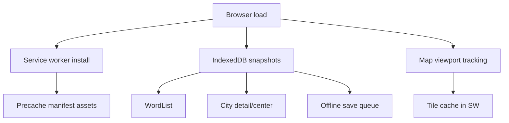

# Offline support

The Wolo encoder web app is designed to keep working after at least one successful online visit. Offline behavior is layered: the app shell, encode/decode data, map tiles for the last viewed area, and queued account saves.

## Architecture



### Service worker (`Root/sw.js`)

- Versioned caches (`wolo-offline-v1:*`).
- Install step loads `Root/precache-manifest.json` and precaches the listed assets.
- Navigation requests: network-first with cached shell fallback (`/` or `/index.html`).
- Same-origin static assets: cache-first.
- Google Maps tile hosts: cache-first with background refresh and a 500-entry cap.
- Firebase/auth/API calls: network-only (except queued offline saves handled in app code).

Regenerate the manifest after publish/bake:

```bash
npm run generate:precache
```

The generator scans `public/index.html` for hashed bundles such as `root-<hash>.min.js` and merges them with the default asset list.

### Encode/decode data

| Data | Online source | Offline source |
|------|---------------|----------------|
| Word list | Firebase `/WordList` | IndexedDB snapshot, then `/offline-data/WordList.json` bootstrap |
| City metadata | Firebase `/CityDetail/{id}` | IndexedDB snapshot after first successful fetch |
| City center | Firebase `/CityCenter/{id}` | IndexedDB snapshot after first successful fetch |

Cities are cached automatically when loaded (decode history, saved addresses, encode/decode flows). GeoFire periphery search and IP/geolocation city lookup still require network.

### Map tiles

- `OfflineStatus.js` stores the latest map center, zoom, and bounds in IndexedDB.
- The service worker caches tile responses from Google Maps tile hosts while online.
- Offline map view shows cached tiles for areas already visited; missing tiles show the offline banner instead of blocking encode/decode.

### Offline save queue

- `Account.js` queues address saves in IndexedDB when offline or when Firebase returns a network error.
- `OfflineQueue.js` flushes the queue on `window.online` and shows a badge/count until sync completes.
- Auth is not bypassed: saves only flush for the signed-in user once connectivity returns.

### UX for network-required features

| Feature | Offline behavior |
|---------|------------------|
| Sign-in / Firebase Auth | Blocked with “needs an internet connection” toast |
| First-time city download / GeoFire search | Requires network; cached cities still work |
| Google Places search / geocoding | Requires network |
| Encode on map click | Requires geocoding unless city/context already cached |
| Decode with cached city + word list | Works offline |
| Saved address list | Read from last online sync; new saves queue offline |

### Recovery

Long-press the logo (or use **Clear cache & reload** in the exception dialog) to delete all caches, unregister service workers, and reload. This remains the escape hatch for bad deploys.

## Manual verification (Chrome DevTools)

1. Open the app online and wait for the service worker to install.
2. Application → Service Workers: confirm `/sw.js` is activated.
3. Application → Cache Storage: verify `wolo-offline-v1:static` contains `root.js`, `offline-data/WordList.json`, etc.
4. Use the app in a supported city so city data is cached.
5. Pan/zoom the map to cache tiles for that area.
6. Enable **Offline** in the Network panel (or DevTools → Application → Service Workers → Offline).
7. Reload: app shell should load.
8. Decode a Wolo Code with a cached city: should resolve on the map with cached tiles.
9. Save an address while logged in: should show “Saved offline — will sync when online”.
10. Go back online: badge clears and queued saves sync.

## Tests

```bash
npm test
```

CI runs the same suite in `.github/workflows/offline-tests.yml`.

## Publish / bake follow-ups (Windows E: tree)

1. Run `npm run generate:precache` after Tiggu publish so `public/` hashed bundles are listed in `Root/precache-manifest.json`.
2. Ensure `Root/Files/offline-data/WordList.json` stays aligned with the Firebase `/WordList` seed when the word list changes.
3. Deploy `sw.js`, `precache-manifest.json`, and `offline-data/WordList.json` with the rest of hosting output.
4. Bump `version` in `precache-manifest.json` (or set `WOLO_SW_CACHE_VERSION`) when you need clients to drop old caches.

## FAQ note

Older FAQ copy stated the web app lacked offline caching. With this work, the PWA shell, cached word list, cached cities, last-area map tiles, and offline save queue are supported within the limits above. Firebase Auth and worldwide offline maps are still out of scope.
